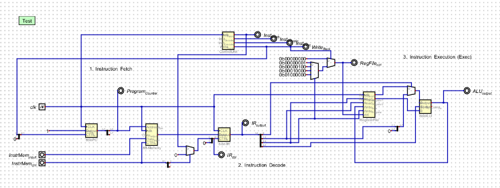
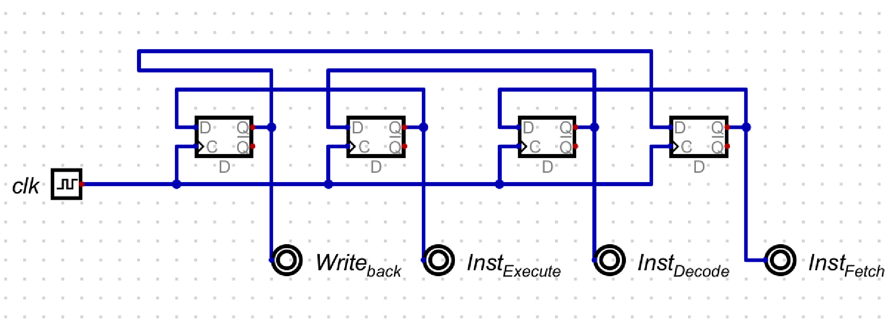

# Assignment 3 – Building an 8-bit CPU in **Digital**

## Overview

In this assignment you will combine everything you built in **Assignment 1** (PC, Instruction Memory, IR) and **Assignment 2** (Register File, ALU) into a working **8-bit CPU** in the **Digital** simulator by H. Neemann.

Your CPU will:

- Fetch **8-bit instructions** from an 8-bit-wide instruction memory (one word per instruction).
- Use a single **8-bit Instruction Register (IR)** to hold the current instruction.
- Execute instructions using your **Register File (R0–R3)** and **8-bit ALU**.
- Be controlled by a **4-state finite state machine (FSM)** implementing a simple pipeline:
  - FETCH → DECODE → EXECUTE → WRITEBACK → FETCH → …

The reference processor layout is shown below (your implementation should follow this structure):



The Control Unit detail (4 D flip-flops in a ring):



The processor has three clearly labeled stages:
1. **Instruction Fetch** — Program Counter, Instruction Memory (8B-Memory), Instruction Register (8-bit IR)
2. **Instruction Decode** — Splitters extract opcode, op1, op2, type fields; muxes route control signals
3. **Instruction Execution (Exec)** — Register File and 8-bit ALU compute and write back results

---

## Instruction Set

Your CPU supports **all 8 ALU operations** in both R-type and I-type format:

### R-type Instructions (type bit = 0)

In R-type, the ALU operates on register values. `op1` selects both the destination and the first operand (ALU input A = R[op1]). `op2` selects the second operand (ALU input B = R[op2]).

| Opcode (3 bits) | Instruction      | Meaning                          | ALU Control {S1,S0,Cin} |
|:----------------:|------------------|----------------------------------|:------------------------:|
| 000              | ADD Rd, Rs       | R[d] ← R[d] + R[s]              | 0 0 0                   |
| 001              | ADDC Rd, Rs      | R[d] ← R[d] + R[s] + 1          | 0 0 1                   |
| 010              | SUBB Rd, Rs      | R[d] ← R[d] + ~R[s] (sub borrow)| 0 1 0                   |
| 011              | SUB Rd, Rs       | R[d] ← R[d] − R[s]              | 0 1 1                   |
| 100              | PASS Rd          | R[d] ← R[d] (transfer A)        | 1 0 0                   |
| 101              | INC Rd           | R[d] ← R[d] + 1                 | 1 0 1                   |
| 110              | DEC Rd           | R[d] ← R[d] − 1                 | 1 1 0                   |
| 111              | PASS Rd          | R[d] ← R[d] (transfer A)        | 1 1 1                   |

### I-type Instructions (type bit = 1)

In I-type, the **op2 field serves as a 2-bit immediate value** (0–3). The immediate is zero-extended to 8 bits and fed to ALU input A instead of R[op1]. The most useful I-type instruction is **LDI** (Load Immediate):

| Opcode | Instruction       | Meaning                                | ALU Control {S1,S0,Cin} |
|:------:|--------------------|----------------------------------------|:------------------------:|
| 100    | LDI Rd, #imm2     | R[d] ← imm2 (zero-extended to 8 bits) | 1 0 0                   |

> **How LDI works:** The type bit = 1 routes the immediate (from op2) to ALU input A. Opcode 100 is "Transfer A" (Output = A + 0 + 0 = A). So the ALU simply passes the immediate through, and it gets written to R[d] during WRITEBACK.

> **Note:** Other I-type opcode combinations are technically valid (e.g., I-type ADD would compute `imm + R[imm_as_reg_index]`), but **LDI is the primary I-type instruction** you need to use.

---

## 1. Prerequisites (from Assignments 1 & 2)

You should already have the following subcircuits from previous assignments:

### From Assignment 1

- **Program Counter (PC)**
  - 8-bit register with 2-bit CTRL input:
    - `00` → Hold (load from self — no change)
    - `01` → Increment (PC ← PC + 1)
    - `10` → Clear (PC ← 0)
    - `11` → Set all bits (PC ← 0xFF)
  - Only **bits [2:0]** of the PC are used as the memory address (8 instruction slots).

- **Instruction Memory (8B-Memory)**
  - 8-bit data width, 8 addresses (0–7).
  - Address input: 3 bits (from PC[2:0]).
  - Data input: 8 bits (for programming instructions externally).
  - CTRL input: 2 bits (`00` = hold, `01` = store from external input).
  - Data output: 8 bits (instruction word).

- **Instruction Register (8-bit IR)**
  - 8-bit register with 2-bit CTRL:
    - `00` → Hold
    - `01` → Store (capture input from memory)
    - `10` → Clear
    - `11` → Set all bits
  - Receives input from instruction memory data output.

### From Assignment 2

- **Register File**
  - Four 8-bit registers: **R0, R1, R2, R3**.
  - Two read ports, one write port.
  - Inputs:
    - `Read_Register1[1:0]` – selects R0–R3 for output `Read_Data1`.
    - `Read_Register2[1:0]` – selects R0–R3 for output `Read_Data2`.
    - `Write_Register[1:0]` – selects destination register.
    - `Write_data[7:0]` – 8-bit data to be written (from ALU output).
    - `ctrl[7:0]` – 8-bit control bus (2 bits per register, see Section 5).
  - Outputs:
    - `Read_Data1[7:0]`, `Read_Data2[7:0]`.

- **ALU (8-bit)**
  - Inputs:
    - `A[7:0]`, `B[7:0]`
    - Control bits `{S1,S0,Cin}` (3 bits) — comes directly from the **opcode** field.
  - Output:
    - `Output[7:0]` – result.
    - `Status` – carry out flag.
  - Internally uses a 4-to-1 mux to select the ALU's Y input:
    - `{S1,S0} = 00` → Y = B
    - `{S1,S0} = 01` → Y = ~B (bitwise complement)
    - `{S1,S0} = 10` → Y = 0x00
    - `{S1,S0} = 11` → Y = 0xFF
  - Then computes: `Output = A + Y + Cin`

---

## 2. Instruction Format

Each instruction is a single **8-bit word** stored at one memory address:

```
  Bit:   7   6   5   4   3   2   1   0
       [  opcode  ] [ op1 ] [ op2 ] [type]
       [S1  S0 Cin] [ d d ] [ s s ] [ T ]
```

| Field   | Bits    | Width | Description                                      |
|---------|---------|:-----:|--------------------------------------------------|
| opcode  | [7:5]   | 3     | ALU control = {S1, S0, Cin}                      |
| op1     | [4:3]   | 2     | Destination register (also Read_Register1, Write_Register) |
| op2     | [2:1]   | 2     | Source register (R-type) or 2-bit immediate (I-type) |
| type    | [0]     | 1     | 0 = R-type, 1 = I-type                          |

**Key design insight:** The opcode bits map **directly** to the ALU control signals `{S1, S0, Cin}`. No separate decode logic is needed for ALU control — just wire the opcode field straight to the ALU!

---

## 3. Pipeline Stages (4-State FSM)

### 3.1 Control Unit FSM

Implement a **4-state one-hot FSM** using four D flip-flops in a ring:

```
  FETCH → DECODE → EXECUTE → WRITEBACK → FETCH → …
```

One flip-flop is initialized to 1 (the FETCH flip-flop), all others to 0. On each clock edge, the active state shifts to the next:

| State      | Active Signal | What Happens                                    |
|------------|:------------:|-------------------------------------------------|
| FETCH      | `Inst_Fetch` | IR captures instruction from memory at PC address |
| DECODE     | `Inst_Decode`| Instruction fields decoded, register file read ports provide operands |
| EXECUTE    | `Inst_Exec`  | ALU computes result (combinational — output is stable) |
| WRITEBACK  | `Write_Back` | Register file writes ALU result to R[op1]; PC increments by 1 |

### 3.2 Control Signal Generation

| Control Signal    | When Active            | Purpose                                      |
|-------------------|------------------------|----------------------------------------------|
| `IR_ctrl = 01`    | FETCH state (and not programming) | IR captures instruction from memory |
| `IR_ctrl = 00`    | All other states       | IR holds its current value                   |
| `PC CTRL = 01`    | WRITEBACK state        | PC increments to next instruction address    |
| `PC CTRL = 00`    | All other states       | PC holds current value (stable for fetch)    |
| `RegFile_ctrl`    | WRITEBACK state        | Selected register gets CTRL=01 (store); all others get 00 (hold) |
| `RegFile_ctrl = 0`| All other states       | All registers hold (no writes)               |

### 3.3 Programming Mode vs Run Mode

The processor supports an external programming interface:

- **Programming mode** (`InstrMem_ctrl = 01`): External data is written to instruction memory at the current PC address. The IR is **prevented** from loading (a mux forces `IR_ctrl = 00`) so the instruction register ignores memory output during programming.
- **Run mode** (`InstrMem_ctrl = 00`): Normal execution. IR loads from memory during FETCH.

---

## 4. Top-Level Datapath (`8BitProcessor`)

Create a new top-level circuit and instantiate the following subcircuits:

- `8bit_PC` — Program Counter
- `8B_Memory` — Instruction Memory (8 locations × 8 bits)
- `8_bit_IR` — Instruction Register
- `RegisterFile` — Register File (R0–R3, 8 bits each)
- `8bitALU` — Arithmetic Logic Unit
- `ControlUnit` — 4-state FSM

### 4.1 External Inputs and Outputs

**Inputs:**

| Signal             | Width | Description                              |
|--------------------|:-----:|------------------------------------------|
| `clk`              | 1     | System clock                             |
| `InstrMem_input`   | 8     | Data to write into instruction memory    |
| `InstrMem_ctrl`    | 2     | Instruction memory control (01 = store)  |

**Outputs (expose these as probes for debugging):**

| Signal             | Width | Description                              |
|--------------------|:-----:|------------------------------------------|
| `Program_Counter`  | 3     | Current PC value (bits [2:0])            |
| `IR_output`        | 8     | Current instruction in the IR            |
| `IR_ctrl`          | 2     | IR control signal                        |
| `Inst_Fetch`       | 1     | Fetch state indicator                    |
| `Inst_Decode`      | 1     | Decode state indicator                   |
| `Inst_Exec`        | 1     | Execute state indicator                  |
| `Write_Back`       | 1     | Writeback state indicator                |
| `RegFile_ctrl`     | 8     | Register file control bus                |
| `ALU_output`       | 8     | ALU result                               |

### 4.2 Step-by-Step Wiring Guide

> **Refer to the reference screenshot (`8-bit-processor-Digital-simulator.png`) throughout this section.** The screenshot shows the complete processor with three labeled stages and all wiring visible. Your implementation should match this layout.

Below is a **complete, step-by-step guide** for wiring every connection. Follow these steps in order.

---

#### Step 0: Place All Components on the Canvas

Open a new top-level circuit in Digital (name it `8BitProcessor`). Add the following components to the canvas, roughly matching the reference screenshot layout:

**External Inputs (left side):**
1. A **Clock** input — label it `clk`. Place it at the left side.
2. An **8-bit Input** pin — label it `InstrMem_input`. Place it at the bottom-left.
3. A **2-bit Input** pin — label it `InstrMem_ctrl`. Place it below `InstrMem_input`.

**Subcircuits (from your previous assignments):**
4. **`ControlUnit`** — your 4-state FSM. Place it at the **top-center** of the canvas. It has one input (`clk`) and four outputs (`Inst_Fetch`, `Inst_Decode`, `Inst_Execute`, `Write_back`).
5. **`8bit_PC`** — Program Counter. Place it on the **left**, in the "Stage 1" area. It has inputs `CLK`, `Inc_by` (8-bit), `CTRL` (2-bit), and output `Output` (8-bit).
6. **`8B_Memory`** — Instruction Memory. Place it to the **right of the PC** in Stage 1. It has inputs `Address_pin` (3-bit), `clk`, `Data_input` (8-bit), `CTRL` (2-bit), and output `Data_output` (8-bit).
7. **`8_bit_IR`** — Instruction Register. Place it to the **right of the Memory** in Stage 1. It has inputs `CLK`, `Input` (8-bit), `CTRL` (2-bit), and output `Output` (8-bit).
8. **`RegisterFile`** — Register File. Place it in the **right half** of the canvas (Stage 3). It has inputs `clk`, `Read_Register1` (2-bit), `Read_Register2` (2-bit), `Write_data` (8-bit), `Write_Register` (2-bit), `ctrl` (8-bit), and outputs `Read_Data1` (8-bit), `Read_Data2` (8-bit).
9. **`8bitALU`** — ALU. Place it to the **right of the Register File** in Stage 3. It has inputs `A` (8-bit), `B` (8-bit), `S_1_S_0_Carry_in` (3-bit), and outputs `Output` (8-bit), `Status` (1-bit carry).

**Additional Digital components you need to add:**
10. **Three 8-bit Constants** — values `0b00000001`, `0b00000100`, `0b00010000`, `0b01000000`, `0b00000000` (five total). These are the register file selector values. Place them above the 4-to-1 mux in Stage 3 (see screenshot).
11. **One 4-to-1 Mux (8-bit)** — for register file write-select. In Digital: *Components → Plexer → Multiplexer*, set "Number of Selector Bits" to 2 and "Bits" to 8.
12. **Three 2-to-1 Muxes:**
    - One **1-bit 2-to-1 mux** for IR control (Stage 1, right of memory).
    - One **8-bit 2-to-1 mux** for gating the register file write (Stage 3, between the 4-to-1 mux and the RegisterFile).
    - One **8-bit 2-to-1 mux** for ALU input A type selection (Stage 3, left of ALU).
13. **Splitters** — to break the IR output into fields. In Digital: *Components → Wires → Splitter*. You need splitters to extract bits [7:5], [4:3], [2:1], and [0] from the 8-bit IR output.
14. **One Bit Extender / Splitter** — to zero-extend the 2-bit `op2` to 8 bits (a splitter that combines `{6'b000000, op2[1:0]}` into an 8-bit value).
15. **Constant values:** `0` (1-bit) and `1` (8-bit value 1) for various control lines.

**Output Probes (for debugging):**
16. Add **Output** pins (probes) and label them: `Program_Counter`, `IR_output`, `IR_ctrl`, `Inst_Fetch`, `Inst_Decode`, `Inst_Exec`, `Write_Back`, `RegFile_ctrl`, `ALU_output`. These are visible as circles with labels in the reference screenshot.

---

#### Step 1: Wire the Control Unit

The Control Unit is a ring of 4 D flip-flops (see the `8-bit-processor_control_unit.png` screenshot). If you haven't built this yet, create it as a subcircuit:

1. Place **four D flip-flops** in a row. In Digital: *Components → Flip-Flops → D Flip-Flop*.
2. Connect `clk` to the **C** (clock) input of all four flip-flops.
3. Wire them in a ring:
   - `Q` of flip-flop 4 (rightmost) → `D` of flip-flop 3
   - `Q` of flip-flop 3 → `D` of flip-flop 2
   - `Q` of flip-flop 2 → `D` of flip-flop 1
   - `Q` of flip-flop 1 (leftmost) → `D` of flip-flop 4 (back to rightmost)
4. **Initialize flip-flop 4** (the FETCH flip-flop) to **Default = 1**. Right-click the flip-flop, go to its properties, and set "Default" to 1. All other flip-flops keep Default = 0.
5. Wire the `Q` outputs to the circuit outputs:
   - Flip-flop 4 Q → `Inst_Fetch`
   - Flip-flop 3 Q → `Inst_Decode`
   - Flip-flop 2 Q → `Inst_Execute`
   - Flip-flop 1 Q → `Write_back`

Back in the top-level circuit:
- Connect `clk` → `ControlUnit.clk`.
- Run wires from each ControlUnit output to the corresponding **output probe pins** (`Inst_Fetch`, `Inst_Decode`, `Inst_Exec`, `Write_Back`). These signals will be used by other components below.

---

#### Step 2: Wire the Program Counter (Stage 1)

The PC increments by 1 during WRITEBACK only. All other states hold.

1. **`8bit_PC.CLK`** ← wire from `clk`.
2. **`8bit_PC.Inc_by`** ← place a **constant** with value **1** (8-bit: `0b00000001`). Wire it to `Inc_by`. *(In the screenshot, this constant "1" is above the PC.)*
3. **`8bit_PC.CTRL`** (2 bits) — you need to build this 2-bit bus:
   - **CTRL[0]** ← wire from `Write_Back` (from ControlUnit).
   - **CTRL[1]** ← wire from a **constant 0** (1-bit). *(In the screenshot, this constant "0" is below the PC.)*
   - Use a **Splitter** (set to 2-bit input, split into two 1-bit outputs) or simply combine the two wires into a 2-bit bus using a **Merger** (*Components → Wires → Splitter*, configure as merger: 2 inputs of 1 bit → 1 output of 2 bits). Connect bit 0 = `Write_Back` and bit 1 = constant 0.
4. **`8bit_PC.Output`** (8 bits) — this is the full 8-bit PC value. You only need **bits [2:0]** for the memory address (since memory has only 8 locations). Use a **Splitter** to extract bits [2:0] from the 8-bit output. Wire `PC.Output[2:0]` to the `Program_Counter` output probe and onward to the Memory address.

> **Tip:** In the reference screenshot, the `Program_Counter` probe is placed right after the PC output splitter.

---

#### Step 3: Wire the Instruction Memory (Stage 1)

1. **`8B_Memory.Address_pin`** (3 bits) ← wire from `PC.Output[2:0]` (the 3-bit splitter output from Step 2).
2. **`8B_Memory.clk`** ← wire from `clk`.
3. **`8B_Memory.Data_input`** (8 bits) ← wire from the external input `InstrMem_input`.
4. **`8B_Memory.CTRL`** (2 bits) ← wire from the external input `InstrMem_ctrl`.
5. **`8B_Memory.Data_output`** (8 bits) — this carries the instruction read from memory. Wire this to the IR input (next step).

---

#### Step 4: Wire the Instruction Register and IR Control Mux (Stage 1)

The IR should load during FETCH (in run mode) but **not** during programming mode. A 2-to-1 mux handles this.

**4a. Build the IR control mux:**

1. Place a **1-bit 2-to-1 mux** (*Components → Plexer → Multiplexer*, Selector Bits = 1, Bits = 1).
2. Wire the mux inputs:
   - **`sel`** ← `InstrMem_ctrl[0]` (bit 0 of the InstrMem_ctrl input). Use a **Splitter** on the 2-bit `InstrMem_ctrl` to extract bit [0].
   - **`in_0`** ← `Inst_Fetch` (from ControlUnit). This is the normal run mode — IR loads during FETCH.
   - **`in_1`** ← **constant 0** (1-bit). During programming, IR does NOT load.
3. The mux **output** produces `IR_ctrl[0]`.

> **Looking at the screenshot:** You can see this mux between the Memory and the IR, with a constant `0` wired to one input and `Inst_Fetch` to the other. A splitter on `InstrMem_ctrl` feeds the select line(s).

**4b. Assemble the 2-bit IR_ctrl bus:**

1. **IR_ctrl[0]** = output of the mux above.
2. **IR_ctrl[1]** = **constant 0** (1-bit). *(In the screenshot, there is a "0" constant wired below the IR for this.)*
3. Use a **Merger** (or Splitter configured as merger) to combine these two 1-bit values into a 2-bit bus: bit 0 = mux output, bit 1 = constant 0.

**4c. Wire the IR:**

1. **`8_bit_IR.CLK`** ← wire from `clk`.
2. **`8_bit_IR.Input`** (8 bits) ← wire from `8B_Memory.Data_output`.
3. **`8_bit_IR.CTRL`** (2 bits) ← wire from the 2-bit `IR_ctrl` bus you just built.
4. **`8_bit_IR.Output`** (8 bits) — this is the current instruction. Wire this to the `IR_output` probe and onward to the splitters in Stage 2.
5. Wire the 2-bit `IR_ctrl` bus to the `IR_ctrl` output probe as well.

---

#### Step 5: Decode the Instruction — Split IR Output into Fields (Stage 2)

Use **Splitters** to break the 8-bit IR output into four fields. In the reference screenshot, you can see the splitters right after the IR, with wires fanning out to different parts of Stage 3.

Place a **Splitter** on the `8_bit_IR.Output` wire (8 bits → individual bit groups). Configure it to extract:

| Field     | IR Bits  | Width | Splitter Output |
|-----------|----------|:-----:|-----------------|
| **type**  | `[0]`    | 1 bit | Goes to ALU input A mux (select line) |
| **op2**   | `[2:1]`  | 2 bits| Goes to `RegisterFile.Read_Register2` and zero-extender |
| **op1**   | `[4:3]`  | 2 bits| Goes to `RegisterFile.Read_Register1`, `RegisterFile.Write_Register`, and RegFile ctrl mux (select) |
| **opcode**| `[7:5]`  | 3 bits| Goes directly to `8bitALU.S_1_S_0_Carry_in` |

> **How to configure the splitter in Digital:** Right-click the splitter, set "Input Bits" to 8, and configure the output groups as: `1, 2, 2, 3` (from LSB to MSB). This gives you four outputs for type (1 bit), op2 (2 bits), op1 (2 bits), and opcode (3 bits) respectively.

> **In the screenshot**, you can see these splitter outputs fanning out: type goes down-right to the ALU input A mux, op2 goes right to the Register File and down to a zero-extender, op1 goes right to the Register File and up to the 4-to-1 mux, and opcode goes far right to the ALU.

---

#### Step 6: Build the Zero-Extension Path for I-type Immediates (Stage 2/3)

For I-type instructions, the 2-bit `op2` field is used as an immediate value. It must be **zero-extended to 8 bits** before entering the ALU.

1. Take the 2-bit `op2` output from the splitter.
2. Use a **Splitter configured as a Merger** to create an 8-bit value where:
   - Bits `[1:0]` = `op2` (2 bits)
   - Bits `[7:2]` = constant `0` (6 bits)
3. To do this in Digital: place a Splitter with 8-bit output and two input groups: first group = 2 bits (from op2), second group = 6 bits (from a 6-bit constant 0). *(Alternatively, you can use a Bit Extender component set to zero-extend from 2 bits to 8 bits.)*

> **In the screenshot**, you can see a constant `0` near the bottom-right of the canvas and a merger/splitter that combines it with `op2` to create the 8-bit zero-extended immediate.

The resulting 8-bit value goes to one input of the ALU input A mux (next step).

---

#### Step 7: Wire the ALU Input A Mux — Type Selection (Stage 3)

This mux selects whether ALU input A comes from a register (R-type) or from the zero-extended immediate (I-type).

1. Place an **8-bit 2-to-1 mux** (*Components → Plexer → Multiplexer*, Selector Bits = 1, Bits = 8).
2. Wire the mux:
   - **`sel`** ← `type` bit (IR[0], from the splitter in Step 5).
   - **`in_0`** ← `RegisterFile.Read_Data1` (8 bits). This is the R-type path — ALU input A = R[op1].
   - **`in_1`** ← the 8-bit zero-extended `op2` (from Step 6). This is the I-type path — ALU input A = immediate.
3. The mux **output** (8 bits) goes to `8bitALU.A`.

> **In the screenshot**, this mux is placed to the left of the ALU, just below the Register File. The `type` bit wire comes from the splitter on the far left of Stage 3.

---

#### Step 8: Wire the Register File (Stage 3)

1. **`RegisterFile.clk`** ← wire from `clk`.
2. **`RegisterFile.Read_Register1`** (2 bits) ← wire from `op1` (IR[4:3], from splitter in Step 5). This selects which register value appears on `Read_Data1`.
3. **`RegisterFile.Read_Register2`** (2 bits) ← wire from `op2` (IR[2:1], from splitter in Step 5). This selects which register value appears on `Read_Data2`.
4. **`RegisterFile.Write_Register`** (2 bits) ← wire from `op1` (same `op1` signal — the destination register is always `op1`).
5. **`RegisterFile.Write_data`** (8 bits) ← wire from `8bitALU.Output`. The ALU result is written back to the register file.
6. **`RegisterFile.ctrl`** (8 bits) ← wire from the **register file write-control logic** (built in Steps 9–10 below).
7. **`RegisterFile.Read_Data1`** (8 bits) → goes to the ALU input A mux `in_0` (Step 7).
8. **`RegisterFile.Read_Data2`** (8 bits) → goes directly to `8bitALU.B`.

> **Important:** Notice that `op1` connects to **three** Register File ports: `Read_Register1`, `Write_Register`, and also to the 4-to-1 mux select (Step 9). In the screenshot, you can see the `op1` wire branching to all three destinations.

---

#### Step 9: Build the Register File Write-Select Mux (Stage 3)

The Register File uses an **8-bit control bus** where each register gets 2 control bits. To write to exactly one register, you need to generate a one-hot style control word based on `op1`.

**9a. Place five 8-bit constants:**

In the reference screenshot, these constants are stacked vertically in the upper-right area, above the 4-to-1 mux:

| Constant           | Value (binary)  | Purpose                      |
|--------------------|:---------------:|------------------------------|
| `0b00000000`       | 0               | No register write (displayed but used in Step 10) |
| `0b00000001`       | 1               | Write to R0 (ctrl[1:0] = 01) |
| `0b00000100`       | 4               | Write to R1 (ctrl[3:2] = 01) |
| `0b00010000`       | 16              | Write to R2 (ctrl[5:4] = 01) |
| `0b01000000`       | 64              | Write to R3 (ctrl[7:6] = 01) |

> **To create constants in Digital:** *Components → IO → Constant*, then right-click to set the value. Set "Bits" to 8 and enter the value in binary or decimal.

**9b. Place a 4-to-1 mux (8-bit):**

1. Add a **Multiplexer** with Selector Bits = 2 and Bits = 8.
2. Wire the **select** line ← `op1` (2 bits, from the splitter in Step 5).
3. Wire the data inputs:
   - **`in_0`** ← constant `0b00000001` (decimal 1) — selected when `op1 = 00` (write R0)
   - **`in_1`** ← constant `0b00000100` (decimal 4) — selected when `op1 = 01` (write R1)
   - **`in_2`** ← constant `0b00010000` (decimal 16) — selected when `op1 = 10` (write R2)
   - **`in_3`** ← constant `0b01000000` (decimal 64) — selected when `op1 = 11` (write R3)
4. The mux **output** is the register-select control word for the destination register.

> **In the screenshot**, this 4-to-1 mux is in the upper-right, with the five constants stacked to its left. The `op1` wire comes from the splitter area and connects to the mux select.

---

#### Step 10: Gate Register Writes with Write_Back (Stage 3)

Registers should **only** be written during the WRITEBACK state. All other states must output `0b00000000` (all registers hold).

1. Place an **8-bit 2-to-1 mux** (Selector Bits = 1, Bits = 8).
2. Wire the mux:
   - **`sel`** ← `Write_Back` (from ControlUnit).
   - **`in_0`** ← constant `0b00000000` (decimal 0, 8-bit). When NOT in writeback, all register controls = 00 (hold).
   - **`in_1`** ← output of the 4-to-1 mux from Step 9. When in writeback, the selected register gets ctrl = 01 (store).
3. The mux **output** (8 bits) is `RegFile_ctrl`. Wire this to:
   - **`RegisterFile.ctrl`** (from Step 8, connection #6).
   - The **`RegFile_ctrl`** output probe.

> **In the screenshot**, this 2-to-1 mux sits between the 4-to-1 mux (above) and the Register File (below-right). The `Write_Back` signal comes from the ControlUnit at the top.

---

#### Step 11: Wire the ALU (Stage 3)

1. **`8bitALU.A`** (8 bits) ← wire from the output of the **type mux** (Step 7).
2. **`8bitALU.B`** (8 bits) ← wire from `RegisterFile.Read_Data2`.
3. **`8bitALU.S_1_S_0_Carry_in`** (3 bits) ← wire from `opcode` (IR[7:5], from the splitter in Step 5). **This is the key design insight — the opcode maps directly to ALU control with no extra decode logic!**
4. **`8bitALU.Output`** (8 bits) → wire to:
   - **`RegisterFile.Write_data`** (Step 8, connection #5) — ALU result is written back to the register.
   - The **`ALU_output`** output probe.

> **In the screenshot**, the ALU is at the far right. The `opcode` wire runs from the splitter area all the way across to the ALU's control input at the top. The ALU output feeds back left to the Register File's `Write_data` input.

---

#### Step 12: Add Output Probes

Add **Output** pins (probes) at the following locations for debugging and testing. In the reference screenshot, these appear as labeled circles (⊙) throughout the circuit:

| Probe Label          | Wire It To                              | Width  | Location in Screenshot       |
|----------------------|------------------------------------------|:------:|------------------------------|
| `Program_Counter`    | `PC.Output[2:0]` (after splitter)        | 3 bits | Center-left, after PC        |
| `IR_output`          | `8_bit_IR.Output`                        | 8 bits | Center, after IR             |
| `IR_ctrl`            | 2-bit IR_ctrl bus (from Step 4b)         | 2 bits | Center, below IR             |
| `Inst_Fetch`         | `ControlUnit.Inst_Fetch`                 | 1 bit  | Top-right of ControlUnit     |
| `Inst_Decode`        | `ControlUnit.Inst_Decode`                | 1 bit  | Top-right of ControlUnit     |
| `Inst_Exec`          | `ControlUnit.Inst_Execute`               | 1 bit  | Top-right of ControlUnit     |
| `Write_Back`         | `ControlUnit.Write_back`                 | 1 bit  | Top-right of ControlUnit     |
| `RegFile_ctrl`       | Output of write-gate mux (Step 10)       | 8 bits | Upper-right, after gate mux  |
| `ALU_output`         | `8bitALU.Output`                         | 8 bits | Far right, after ALU         |

> **Tip:** In Digital, add output pins via *Components → IO → Output*. Set the bit width to match the signal, and label each one. These probes are essential for the test script to verify your processor's behavior.

---

#### Wiring Summary Diagram

Here is the complete signal flow in text form, matching the reference screenshot:

```
                          ┌──────────────┐
                    clk──→│ ControlUnit  │
                          │              ├──→ Inst_Fetch ──→ IR ctrl mux (in_0)
                          │              ├──→ Inst_Decode
                          │              ├──→ Inst_Execute
                          │              ├──→ Write_Back ──→ PC.CTRL[0]
                          └──────────────┘        │          RegFile gate mux (sel)
                                                  │
  ┌─ Stage 1: Instruction Fetch ─────────────────────────────────────────────┐
  │                                                                          │
  │  const 1 ──→ PC.Inc_by       8B_Memory               8_bit_IR           │
  │  const 0 ──→ PC.CTRL[1]    ┌──────────┐            ┌──────────┐         │
  │      clk ──→ PC.CLK        │Address←PC[2:0]        │Input←Mem.Out       │
  │  WB ──────→ PC.CTRL[0]     │clk←clk   │            │CLK←clk   │         │
  │              PC.Out[2:0]──→ │Data_in←InstrMem_input │CTRL←IR_ctrl        │
  │                             │CTRL←InstrMem_ctrl     │Output──→(to Stage 2)
  │                             │Data_out──→ IR.Input   └──────────┘         │
  │                             └──────────┘                                 │
  │                                                                          │
  │  IR ctrl mux (2-to-1, 1-bit):                                           │
  │    sel = InstrMem_ctrl[0]                                                │
  │    in_0 = Inst_Fetch    ← normal: IR loads during FETCH                 │
  │    in_1 = 0             ← programming: IR does NOT load                 │
  │    out → IR_ctrl[0]                                                      │
  │    IR_ctrl[1] = 0 (constant)                                             │
  └──────────────────────────────────────────────────────────────────────────┘

  ┌─ Stage 2: Instruction Decode ────────────────────────┐
  │                                                       │
  │  IR.Output (8 bits) ──→ Splitter:                     │
  │    [0]   → type   (1 bit) ──→ ALU input A mux sel    │
  │    [2:1] → op2    (2 bits) ──→ RegFile.Read_Reg2     │
  │                                  + zero-extend → mux  │
  │    [4:3] → op1    (2 bits) ──→ RegFile.Read_Reg1     │
  │                                  + RegFile.Write_Reg  │
  │                                  + 4-to-1 mux sel     │
  │    [7:5] → opcode (3 bits) ──→ ALU.S_1_S_0_Carry_in │
  │                                                       │
  │  Zero-extend op2:  {6'b000000, op2[1:0]} → 8 bits   │
  └───────────────────────────────────────────────────────┘

  ┌─ Stage 3: Execution & Writeback ─────────────────────────────────────────┐
  │                                                                          │
  │  4-to-1 Mux (8-bit):             2-to-1 Gate Mux (8-bit):               │
  │    sel = op1                        sel = Write_Back                     │
  │    in_0 = 0b00000001 (R0)          in_0 = 0b00000000 (hold)             │
  │    in_1 = 0b00000100 (R1)          in_1 = (4-to-1 mux out)             │
  │    in_2 = 0b00010000 (R2)          out → RegFile.ctrl                   │
  │    in_3 = 0b01000000 (R3)                                               │
  │    out → gate mux in_1                                                   │
  │                                                                          │
  │  ALU Input A Mux (2-to-1, 8-bit):     ALU:                              │
  │    sel = type                            A ← type mux out               │
  │    in_0 = RegFile.Read_Data1             B ← RegFile.Read_Data2         │
  │    in_1 = zero-extended op2              S1_S0_Cin ← opcode             │
  │    out → ALU.A                           Output → RegFile.Write_data    │
  │                                                    → ALU_output probe   │
  └──────────────────────────────────────────────────────────────────────────┘
```

---

## 5. Register File Write Control — Conceptual Explanation

The register file uses an **8-bit control bus** (`ctrl[7:0]`) where each register gets 2 bits:

| Register | Control Bits | CTRL=01 Means |
|----------|:------------:|---------------|
| R0       | `ctrl[1:0]`  | Store (write) |
| R1       | `ctrl[3:2]`  | Store (write) |
| R2       | `ctrl[5:4]`  | Store (write) |
| R3       | `ctrl[7:6]`  | Store (write) |

The 4-to-1 mux (Step 9) selects which register's bits get set to `01`, and the 2-to-1 gate mux (Step 10) ensures this only happens during WRITEBACK. In all other FSM states, `RegFile_ctrl = 0x00`, so all registers hold their values.

---

## 6. PC Increment Logic — Conceptual Explanation

The Program Counter should:
- **Hold** during FETCH, DECODE, and EXECUTE (CTRL = `00`).
- **Increment by 1** during WRITEBACK (CTRL = `01`).

From Step 2:
```
PC.CTRL[0] = Write_Back      ← 1 only during WRITEBACK
PC.CTRL[1] = 0 (constant)    ← always 0
PC.Inc_by  = 0b00000001      ← constant 1
```

This means `PC.CTRL = 01` only when `Write_Back = 1`, causing the PC to advance to the next instruction after each instruction completes. Since only bits [2:0] address the memory, after instruction 7 the PC wraps around to 0.

---

## 7. Testing Your CPU in Digital

### 7.1 Programming Phase

To load a program, use the external `InstrMem_input` and `InstrMem_ctrl` signals:

1. Set `InstrMem_ctrl = 01` (store mode) and `InstrMem_input` to the instruction byte.
2. Pulse the clock — the instruction is stored at `memory[PC]`.
3. Set `InstrMem_ctrl = 00` and pulse the clock 3 more times — the FSM completes its cycle, and on WRITEBACK the PC increments.
4. Repeat for each instruction.

After programming all 8 instructions, the PC wraps around to 0 (since only bits [2:0] are used). Set `InstrMem_ctrl = 00` to enter run mode.

### 7.2 Example Test Program

The following program tests **all major operations**:

| Addr | Instruction     | Encoding (binary)   | Decimal | Expected Result        |
|:----:|-----------------|:-------------------:|:-------:|------------------------|
| 0    | LDI R1, #3      | `100 01 11 1`       | 143     | R1 = 3                 |
| 1    | LDI R2, #1      | `100 10 01 1`       | 147     | R2 = 1                 |
| 2    | ADD R1, R2      | `000 01 10 0`       | 12      | R1 = 3 + 1 = 4        |
| 3    | SUB R1, R2      | `011 01 10 0`       | 108     | R1 = 4 − 1 = 3        |
| 4    | INC R1          | `101 01 00 0`       | 168     | R1 = 3 + 1 = 4        |
| 5    | DEC R1          | `110 01 00 0`       | 200     | R1 = 4 − 1 = 3        |
| 6    | ADDC R1, R2     | `001 01 10 0`       | 44      | R1 = 3 + 1 + 1 = 5    |
| 7    | PASS R1         | `100 01 00 0`       | 136     | R1 = 5 (no change)    |

**Register trace after each instruction:**

```
Initial:  R0=0  R1=0  R2=0  R3=0
After 0:  R0=0  R1=3  R2=0  R3=0   ← LDI R1, #3
After 1:  R0=0  R1=3  R2=1  R3=0   ← LDI R2, #1
After 2:  R0=0  R1=4  R2=1  R3=0   ← ADD R1, R2
After 3:  R0=0  R1=3  R2=1  R3=0   ← SUB R1, R2
After 4:  R0=0  R1=4  R2=1  R3=0   ← INC R1
After 5:  R0=0  R1=3  R2=1  R3=0   ← DEC R1
After 6:  R0=0  R1=5  R2=1  R3=0   ← ADDC R1, R2
After 7:  R0=0  R1=5  R2=1  R3=0   ← PASS R1 (unchanged)
```

### 7.3 Hand-Encoding Instructions

To encode an instruction by hand:

1. Look up the **opcode** (3 bits) from the ALU operation table.
2. Determine **op1** (2 bits) — the destination register index.
3. Determine **op2** (2 bits) — the source register index (R-type) or immediate value (I-type).
4. Set **type** (1 bit) — 0 for R-type, 1 for I-type.
5. Concatenate: `opcode | op1 | op2 | type`
6. Convert the 8-bit binary to decimal for the test file.

**Example: SUB R1, R2**
- Opcode = `011` (SUB: A + ~B + 1)
- op1 = `01` (R1)
- op2 = `10` (R2)
- type = `0` (R-type)
- Binary: `011 01 10 0` = `01101100₂` = **108**

**Example: LDI R1, #3**
- Opcode = `100` (Transfer A)
- op1 = `01` (R1)
- op2 = `11` (immediate = 3)
- type = `1` (I-type)
- Binary: `100 01 11 1` = `10001111₂` = **143**

### 7.4 Signals to Probe

Add output pins for easier debugging:

- `Program_Counter[2:0]` — current instruction address
- `IR_output[7:0]` — current instruction
- `IR_ctrl[1:0]` — IR control (01 during fetch, 00 otherwise)
- `Inst_Fetch`, `Inst_Decode`, `Inst_Exec`, `Write_Back` — FSM state indicators
- `RegFile_ctrl[7:0]` — register write enable bus
- `ALU_output[7:0]` — ALU computation result

When you run the simulation, you should observe:

- **FETCH:** `IR_ctrl = 01`, IR captures instruction from memory.
- **DECODE/EXECUTE:** `IR_ctrl = 00`, IR holds. ALU output shows the computed value.
- **WRITEBACK:** `RegFile_ctrl` selects the destination register. `Program_Counter` increments.
- After WRITEBACK of `ADD R1,R2` → `ALU_output = 4`.
- After WRITEBACK of `SUB R1,R2` → `ALU_output = 3`.

### 7.5 Using the Test Script

A test script `test_8bit_processor.txt` is provided. Load it in Digital:

1. Open your top-level processor circuit.
2. Go to **Analysis → Test** or press the **Test** button.
3. Load `test_8bit_processor.txt`.
4. Run the test.

The test will:
1. Program all 8 instructions into memory.
2. Execute each instruction and verify ALU outputs and register behavior.

---

## 8. What to Submit

1. **Digital Project File(s)**
   - Top-level CPU circuit (`8BitProcessor`).
   - Subcircuits for: `8bit_PC`, `8B_Memory`, `8_bit_IR`, `RegisterFile`, `8bitALU`, `ControlUnit`.

2. **Test Program**
   - Use the provided `test_8bit_processor.txt` or create your own.
   - Demonstrate at least: LDI, ADD, SUB, INC, DEC.

3. **Short Report (≈2 pages)**
   - Block diagram of your CPU datapath (can be a screenshot from Digital).
   - Explanation of your 4-state FSM and how each state drives control signals.
   - Description of how an instruction flows through FETCH → DECODE → EXECUTE → WRITEBACK.
   - Screenshots or waveforms showing correct execution of the test program.

4. **Group Submission**
   - You may work in groups of up to **three members**. Each member should submit an individual report indicating their contributions.

---

## 9. ISA Quick Reference

### Registers

- 4 general-purpose registers: **R0, R1, R2, R3** (8 bits each).
- Register indices (2 bits): `00` = R0, `01` = R1, `10` = R2, `11` = R3.
- All registers initialize to 0.

### 8-bit Instruction Format

```
  [7:5]    [4:3]   [2:1]   [0]
  opcode    op1     op2    type
  (3 bit)  (2 bit) (2 bit) (1 bit)
```

### Complete Instruction Encoding Table

| Opcode | op1 | op2 | Type | Instruction      | Effect                     | Decimal Formula                  |
|:------:|:---:|:---:|:----:|------------------|----------------------------|----------------------------------|
| 000    | dd  | ss  | 0    | ADD Rd, Rs       | R[d] ← R[d] + R[s]        | `0*32 + dd*8 + ss*2 + 0`        |
| 001    | dd  | ss  | 0    | ADDC Rd, Rs      | R[d] ← R[d] + R[s] + 1    | `1*32 + dd*8 + ss*2 + 0`        |
| 010    | dd  | ss  | 0    | SUBB Rd, Rs      | R[d] ← R[d] + ~R[s]       | `2*32 + dd*8 + ss*2 + 0`        |
| 011    | dd  | ss  | 0    | SUB Rd, Rs       | R[d] ← R[d] − R[s]        | `3*32 + dd*8 + ss*2 + 0`        |
| 100    | dd  | xx  | 0    | PASS Rd          | R[d] ← R[d]               | `4*32 + dd*8 + 0`               |
| 101    | dd  | xx  | 0    | INC Rd           | R[d] ← R[d] + 1           | `5*32 + dd*8 + 0`               |
| 110    | dd  | xx  | 0    | DEC Rd           | R[d] ← R[d] − 1           | `6*32 + dd*8 + 0`               |
| 100    | dd  | imm | 1    | LDI Rd, #imm     | R[d] ← imm (0–3)          | `4*32 + dd*8 + imm*2 + 1`       |

> `dd` = destination register index (00–11), `ss` = source register index (00–11), `imm` = 2-bit immediate (00–11), `xx` = don't care (use 00).

### Quick Encoding Examples

| Instruction   | opcode | op1 | op2 | type | Binary     | Decimal |
|---------------|:------:|:---:|:---:|:----:|:----------:|:-------:|
| LDI R1, #3    | 100    | 01  | 11  | 1    | 10001111   | 143     |
| LDI R2, #2    | 100    | 10  | 10  | 1    | 10010101   | 149     |
| ADD R1, R2    | 000    | 01  | 10  | 0    | 00001100   | 12      |
| SUB R1, R2    | 011    | 01  | 10  | 0    | 01101100   | 108     |
| INC R1        | 101    | 01  | 00  | 0    | 10101000   | 168     |
| DEC R2        | 110    | 10  | 00  | 0    | 11010000   | 208     |
| ADDC R1, R2   | 001    | 01  | 10  | 0    | 00101100   | 44      |
| PASS R1       | 100    | 01  | 00  | 0    | 10001000   | 136     |

With this reference, you can hand-assemble programs and load them into instruction memory using the test script format.
